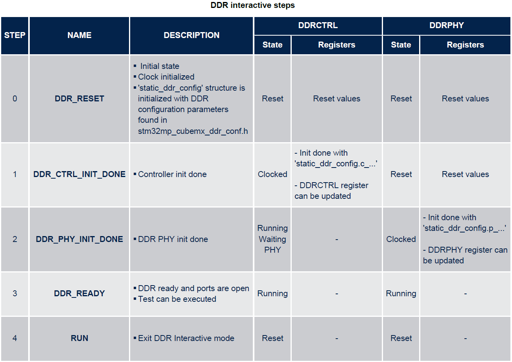
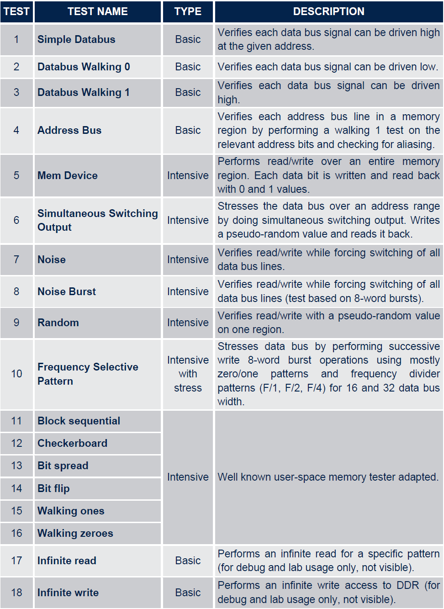
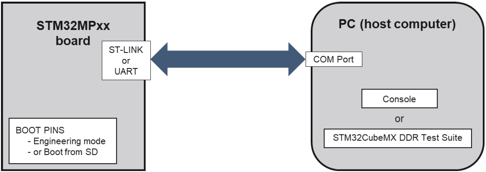

# STM32DDRFW-UTIL Firmware

STM32DDRFW-UTIL is the firmware used to initialize DDR and perform DDR tests.

This document describes:

- the Software Architecture and Design of STM32DDRFW-UTIL.
- how to use the STM32DDRFW-UTIL firmware package for DDR configuration and test on STM32MP1 and STM32MP2 Series MPUs.

## 1 STM32DDRFW-UTIL Architecture and Design

STM32DDRFW-UTIL v1.1.0 applies to STM32MP1 (STM32MP13XX and STM32MP15XX) and STM32MP2 (STM32MP25XX) series.

### 1.1 Package overview

STM32DDRFW-UTIL firmware is a software package containing multiple STM32CubeIDE projects applicable for all STM32 products with a DDR which includes:

- BSP, CMSIS and HAL drivers for all applicable STM32MPxxx series.
- DDR_Tool full source code with:
   - Common directory with general purpose content.
   - STM32CubeIDE Projects for all ST supported boards.
- Binaries for all supported ST boards with BootROM image header to be programmed directly into SDCARD or loaded via STM32CubeProgrammer without using STM32CubeIDE tool.
- Imageheader package to generate stm32 files with STM32CubeIDE.
- resourcemanager package to solve possible dependencies with board BSP (STM32MP2 only).
- Test Report of all applicable STM32MPxxx series.

### 1.2 Design principles

Based on HAL DDR driver, STM32DDRFW-UTIL firmware provides 2 main functionalities:

- Read/Write DDR settings and DDR general information (name, speed, size, …)
- Launch DDR tests

Note that DDR settings are considered differently depending on the related IP:

- DDR controller (DDRCTRL or DDRC) ones corresponds to IP registers
- DDR PHY controller (DDRPHYC) ones corresponds to IP register for STM32MP1 series and to user input parameters of dedicated software for STM32MP2 series.

The STM32DDRFW-UTIL firmware also implements a console in DDR Interactive mode allowing to use these functionalities.

**DDR Interactive mode** enables a special way of running the DDR initialization in which we can move from one initialization step to another (forward and backward) and launch DDR tests using command-lines.

#### 1.2.1 HAL DDR driver APIs

The HAL driver APIs (in stm32mpxxx\_hal\_ddr.c file) provides the functions allowing to initialize the DDR and to access DDR settings in DDR Interactive mode.

***Note:***
*This HAL driver does not fit the split between DRIVER and BSP as defined in the STM32Cube specifications. Board (DDR components) and IP (Controller and PHY) are mixed in the same Hal driver.*

|  API name                    |       Description      |
|------------------------------|------------------------|
|**HAL\_DDR\_Init**   |<ul><li>**brief**<br>DDR init sequence, including <br>- reset/clock/power management (i.e. access to other IPs)<br>- information getting<br>- DDRC and DDRPHYC configuration and initialization<br>- self-refresh mode setup<br>- data/addr tests execution after training.</li><li>**param**<br>*iddr* structure for DDR initialization settings allowing to define/retrieve some system global features.</li>***Note:*** *In STM32DDRFW-UTIL firmware, the low power mechanism is not used, so all parameters can be set to null or false.*<br><li>**retval** HAL status.</li></ul>|
|**HAL\_DDR\_MspInit**|<ul><li>**brief**<br>board-specific DDR power initialization if any.<br>***Note:*** *Only used in STM32DDRFW-UTIL firmware if PMIC (power management IC) is implemented on board.*<br></li><li>**param**<br>*type* DDR type.</li><li>**retval** 0 if OK.</li></ul>|

<br>

|  API name in DDR<br>interactive mode only  |       Description      |
|--------------------------------------------|------------------------|
|**HAL\_DDR\_ASS\_Set\_Clksrc**   |<ul><li>**brief**<br>Set AXI Sub-System Clock Source</li>***Note:*** *In STM32DDRFW-UTIL firmware, this function is used to switch AXI clock source to a different source, in order to change PLL2 rate when changing DDR frequency. Not present on STM32MP2 series.*<br><li>**param**<br>*clksrc* AXI Sub-System clock source.</li><li>**retval** HAL status.</li></ul>|
|**HAL\_DDR\_Interactive**   |<ul><li>**brief**<br>Set DDR step and run tool command.<br>User function implemented in ddr\_tool.c</li><li>**param**<br>*step* DDR Interactive mode step.</li><li>**retval** boolean.</li></ul>|
|**HAL\_DDR\_Dump\_Param**    |<ul><li>**brief**<br>Prints input configuration parameters to be set for all DDR settings. This function will print the setting value from the input configuration parameters provided in the source code and used to initialize the DDR at start.</li><li>**param**<br>*config* static DDR configuration used to initialize the DDR setting name (if NULL, all settings are printed out).</li><li>**retval** HAL status.</li></ul>|
|**HAL\_DDR\_Dump\_Reg**      |<ul><li>**brief**<br>Dump the DDR setting value. This function will print the actual setting value and format the output print if save parameter is true (to be used after DDR initialization in DDR\_READY step).</li><li>**param**<br>*name* setting name (if NULL, all settings are printed out) save indicates if the output print has to be formatted with “#define …” (true) or not.</li><li>**retval** HAL status.</li></ul>|
|**HAL\_DDR\_Edit\_Param**    |<ul><li>**brief**<br>Edit input parameter value. This function allows to change the DDR configuration parameters before initialization in DDR\_RESET step.</li><li>**param**<br>*name* setting name.<br>*string* new parameter value.</li><li>**retval** None.</li></ul>|
|**HAL\_DDR\_Edit\_Reg**      |<ul><li>**brief**<br>Edit DDR setting value. This function allows to change DDR settings after DDR\_CTRL\_INIT\_DONE step for DDRC registers and after DDR\_PHY\_INIT\_DONE step for DDRPHY user input parameters </li><li>**param**<br>*name* setting name<br>*string* new parameter value</li><li>**retval** None.</li></ul>|

#### 1.2.2 DDR Interactive mode

This mode enables a special way of running the DDR initialization in which we can move from one initialization step to another (forward and backward). A set of inline commands are available to set the DDR initialization step and to launch DDR Tool functionalities and tests.

DDR interactive mode uses 5 steps to initialize the DDR controller and the PHY with parameters found in *stm32mp\_util\_ddr\_conf.h*:



***Note 1:***
*On STM32MP2 series, please consider that clock is initialized in step 1, contrary to what is described in the figure above.*

***Note 2:***
*stm32mp\_util\_ddr\_conf.h provides each setting value for DDR controller and PHY. To set the initial DDR configuration parameters in stm32mp\_util\_ddr\_conf.h, templates are provided for each DDR type and it is necessary to have a good knowledge of the DDR SDRAM datasheet to complete the template and provide the first register values (See §1.2.3.3 Customization).*

#### 1.2.3 DDR configuration in STM32DDRFW-UTIL package

The DDR\_Tool project applies to a specific board and contains all related files. All user adaptations should be gathered inside this project directory.
The objective here is not to describe all files, but to focus on major items.

##### 1.2.3.1 .project and .cproject file

These are the two main STM32CubeIDE configuration files:

- ***.project*** lists all the source files that must be built in order to run the project.
- ***.cproject*** contains all the configuration parameters (such as flags, include directories) and can include similar sections in case of multiple build configurations.

##### 1.2.3.2 Flags

Among the series of flags, some of them are mandatory for the DDR Tool.
  
For STM32MP1 series:

- ***DDR\_INTERACTIVE*** is mandatory to enable the DDR interactive mode
- ***DDR\_TYPE\_X*** is also needed in order to determine the DDR type and its density, and to consider the corresponding setting template (for example, DDR\_TYPE\_DDR3\_4Gb will apply settings from stm32mp13xx-cubemx-ddr3-4Gb-template.h in STM32MP135C-DK project). See more details in *§1.2.3.3 Customization*
- ***NO\_CACHE\_USE*** and ***NO\_MMU\_USE*** are set by default to ensure real DDR device access for first tests (this could be a very first step in a customer bring-up phase).
  
For STM32MP2 series:
  
- ***DDR\_INTERACTIVE*** enables the DDR interactive mode
- ***DDR\_SIZE\_Gb=X*** defines the DDR density expressed in Gigabits (Gbits)
- ***DDR\_FREQ=X*** defines the DDR frequency expressed in MegaHertz (MHz)
- ***STM32MP\_DDR\_DUAL\_AXI\_PORT=1*** enables both AXI ports
- ***STM32MP\_DDR3\_TYPE=0/1*** ***STM32MP\_DDR4\_TYPE=0/1*** ***STM32MP\_LPDDR4\_TYPE=0/1*** determine the DDR type (only one possible value =1, others have to be =0), and consider the corresponding setting template. See more details in *§1.2.3.3 Customization*.

##### 1.2.3.3 Customization

The source code of STM32CubeIDE projects for ST boards is provided as example in STM32DDRFW-UTIL firmware package. Each project can be adapted to fit with customized board.
Only two files need to be adapted:

- ***stm32mp\_util\_conf.h***
This file contains UART and PMIC (if any) related configurations, including instance number, pin control and parameters. A specific definition determines if PMIC is active or not on the board.
- ***stm32mp\_util\_ddr\_conf.h***
This file includes all the DDR settings from template file (including PLL2 dedicated parameters), depending on flags defined in STM32CubeIDE project (See *§1.2.3.2 Flags*). All known board templates are present in each project, as a starting point.

**e.g.:**
In STM32MP135C-DK project, *stm32mp\_util\_ddr\_conf.h* includes *stm32mp13xx-ddr3-4Gb-template.h* for STM32MP135C DDR3 4Gb configuration. The file contains all the definitions of DDRCTRL and DDRPHY parameters for this specific type of DDR:

```
/**
  * STM32MP135C DDR3 4Gb configuration
  * 1x DDR3L 4Gb, 16-bit, 533MHz.
  * Reference used MT41K256M16TW-107 P from Micron
  *
  * DDR type / Platform DDR3/3L
  * freq        533MHz
  * width      16
  * datasheet   1
  * DDR density 4
  * timing mode optimized
  * Scheduling/QoS options : type = 6
  * address mapping : RBC
  * Tc > + 85C : N
  *****************************************************************************
  * @attention
  *
  * Copyright (c) 2020 STMicroelectronics.
  * All rights reserved.
  *
  * This software is licensed under terms that can be found in the LICENSE file
  * in the root directory of this software component.
  * If no LICENSE file comes with this software, it is provided AS-IS.
  *
  ******************************************************************************
  */
#ifndef STM32MP13XX_DDR3_4GBIT_H
#define STM32MP13XX_DDR3_4GBIT_H

#define DDR_MEM_NAME "DDR3-1066 bin F 1x4Gb 533MHz v1.53"
#define DDR_MEM_SPEED 533000
#define DDR_MEM_SIZE 0x20000000

#define DDR_MSTR 0x00040401
#define DDR_MRCTRL0 0x00000010
#define DDR_MRCTRL1 0x00000000
#define DDR_DERATEEN 0x00000000
#define DDR_DERATEINT 0x00800000
#define DDR_PWRCTL 0x00000000
#define DDR_PWRTMG 0x00400010
#define DDR_HWLPCTL 0x00000000
#define DDR_RFSHCTL0 0x00210000
#define DDR_RFSHCTL3 0x00000000
#define DDR_RFSHTMG 0x0081008B
#define DDR_CRCPARCTL0 0x00000000
#define DDR_DRAMTMG0 0x121B2414
#define DDR_DRAMTMG1 0x000A041C
#define DDR_DRAMTMG2 0x0608090F
…
#define DDR_PGCR 0x01442E02
#define DDR_PTR0 0x0022AA5B
#define DDR_PTR1 0x04841104
#define DDR_PTR2 0x042DA068
#define DDR_ACIOCR 0x10400812
#define DDR_DXCCR 0x00000C40
#define DDR_DSGCR 0xF200011F
#define DDR_DCR 0x0000000B
#define DDR_DTPR0 0x38D488D0
#define DDR_DTPR1 0x098B00D8
#define DDR_DTPR2 0x10023600
#define DDR_MR0 0x00000840
#define DDR_MR1 0x00000000
#define DDR_MR2 0x00000208
#define DDR_MR3 0x00000000
#define DDR_ODTCR 0x00010000
#define DDR_ZQ0CR1 0x00000038
#define DDR_DX0GCR 0x0000CE81
#define DDR_DX1GCR 0x0000CE81

#endif

```
**e.g.:**
In STM32MP257F-EV1 project, *stm32mp\_util\_ddr\_conf.h* includes *stm32mp2xx-ddr4-2x16Gbits-2x16bits-template.h*. The file contains all the definitions of DDRC and DDRPHY parameters for this specific type of DDR:

```
/*
 * STM32MP257D/F VALID3 board configuration (Cut 2.x)
 * DDR4 2x16Gbits 2x16bits 1200MHz
 *
 * version	2		Product/Cut version (Panther Cut 2.x)
 * package	1		Package selection (18x18 or 14x14)
 * memclk	1200MHz		(2x DFI clock) + range check
 * speed_bin	Worse		from JEDEC
 * width	32		32: full width / 16: half width
 * ranks	1		Single or dual rank
 * density	16Gbits		(per 16bit device)
 * addressing	RBC		row/bank interleaving
 * RDBI		No		Read DBI
 */


#ifndef STM32MP2XX_DDR4_2x16GBITS_2x16BITS_1200MHZ_H
#define STM32MP2XX_DDR4_2x16GBITS_2x16BITS_1200MHZ_H

#define DDR_MEM_NAME	"DDR4 2x16Gbits 2x16bits 1200MHz"
#define DDR_MEM_SPEED	1200000
#define DDR_MEM_SIZE	0x100000000

#define DDR_MSTR 0x01040010
#define DDR_MRCTRL0 0x00000030
#define DDR_MRCTRL1 0x00000000
#define DDR_MRCTRL2 0x00000000
#define DDR_DERATEEN 0x00000000
#define DDR_DERATEINT 0x00000000
#define DDR_DERATECTL 0x00000000
#define DDR_PWRCTL 0x00000000
#define DDR_PWRTMG 0x00130001
#define DDR_HWLPCTL 0x00000002
#define DDR_RFSHCTL0 0x00210010
#define DDR_RFSHCTL1 0x00000000
#define DDR_RFSHCTL3 0x00000000
#define DDR_RFSHTMG 0x0092014A
#define DDR_RFSHTMG1 0x008C0000
#define DDR_CRCPARCTL0 0x00000000
#define DDR_CRCPARCTL1 0x00001000
#define DDR_INIT0 0xC0020002
#define DDR_INIT1 0x00010002
#define DDR_INIT2 0x00000D00
#define DDR_INIT3 0x09400103
#define DDR_INIT4 0x00180000
#define DDR_INIT5 0x00100004
#define DDR_INIT6 0x00080460
#define DDR_INIT7 0x00000C0F
#define DDR_DIMMCTL 0x00000000
#define DDR_RANKCTL 0x0000066F
#define DDR_RANKCTL1 0x0000000D
…
#define DDR_UIS_SWIZZLE_32 0x00000018
#define DDR_UIS_SWIZZLE_33 0x00000000
#define DDR_UIS_SWIZZLE_34 0x00000000
#define DDR_UIS_SWIZZLE_35 0x00000000
#define DDR_UIS_SWIZZLE_36 0x00000000
#define DDR_UIS_SWIZZLE_37 0x00000000
#define DDR_UIS_SWIZZLE_38 0x00000000
#define DDR_UIS_SWIZZLE_39 0x00000000
#define DDR_UIS_SWIZZLE_40 0x00000000
#define DDR_UIS_SWIZZLE_41 0x00000000
#define DDR_UIS_SWIZZLE_42 0x00000000
#define DDR_UIS_SWIZZLE_43 0x00000000

#define DDR_PLL_SOURCE RCC_PLLSOURCE_HSE
#define DDR_PLL_MODE 0
#define DDR_PLL_FBDIV 30
#define DDR_PLL_FREFDIV 1
#define DDR_PLL_FRACIN 0
#define DDR_PLL_POSTDIV1 1
#define DDR_PLL_POSTDIV2 2
#define DDR_PLL_STATE RCC_PLL_ON
#define DDR_PLL_SSM_MODE RCC_PLL_CENTERSPREAD
#define DDR_PLL_SSM_SPREAD 0
#define DDR_PLL_SSM_DIVVAL 0

#endif
```

These templates are available in DDR\_Tool projects. You can also generate a template file using STM32CubeMX Generate Code functionality (See *§3.2.4 Device Tree generation*) and copy its content in STM32CubeIDE project. The template provides DDR parameters based on DDR types used on ST boards. For customized board, with a different DDR reference, the compliance of each DDR parameter with DDR datasheet must be verified and corrections might be required.

#### 1.2.4 DDR tests

##### 1.2.4.1 Test description

Tests are classified in the three following types:

- **Basic tests:** These simple and running fast tests are intended to capture the major configuration or hardware issues showing off immediately.
- **Intensive tests:** These tests use extensive coverage of data and address patterns for noise and high SSO conditions, high throughput traffic or interleaved read/write. Depending on the parameters, the test run time may be long. An intensive test can be deployed progressively, with test trial before launching long and exhaustive test sequences.
- **Stress tests:** These tests are intensive and executed with stretched conditions (such as a small frequency increase 10-20 MHz), with a skew of parameters (for example a fine step delay increase) or with specific frequency selective patterns.

These tests are intended to catch low-margin timings of a configuration that may cause elusive errors and eventual crashes later during run time.
A stress test campaign must always be done during the system bring-up. Stress tests may also be run in case of suspicious failure. Any test and its skewed parameter must be directed to pinpoint the observed failure (for example, when errors are related to specific bit or byte).

All the available tests are detailed in the table below:



In case of test failure, the DDR settings must be adjusted in the initial configuration parameters.

##### 1.2.4.2 Test infinite read/write access to ddr

In order to test infinite write/read access to DDR, you have to define flag *"TEST\_INFINITE\_ENABLE"* in your project.

These tests can only be stopped in Engineering Boot mode execution by:

- breaking the debugger in STM32CubeIDE
- changing the value of the variable "go\_loop" in "DDR\_Test\_Infinite\_read" and "DDR\_Test\_Infinite\_write" functions (in *ddr\_tests.c* file)

## 2 How to use STM32DDRFW-UTIL firmware

### 2.1 Hardware connections

- Your PC is connected to the board through ST-LINK.
- UART communication is handled either by the ST-LINK connection, or by a dedicated port (if available on the HW). By default, the STMicroelectronics boards use USART2 with Bps=115200 Bit=8 Parity=None Stop=1.
- Set the correct boot pins on your board in either Engineering mode or Boot from SD.



***Note:***

*- Refer to the board manual to set the boot pins in the right position*

*- Tera Term software (https://ttssh2.osdn.jp/index.html.en) has been used to test this release, but other terminal emulators could also be used.*

### 2.2 How to compile and launch DDR Tool project

STM32DDRFW-UTIL package contains binaries that can be used directly on STM32 boards and STM32CubeIDE projects that allow to use the DDR Tool in Engineering mode and to modify the source code.

Please install it not so far from root directory, because there can be some long path issues with unexpected behaviors.

This section describes how to compile and launch these projects in STM32CubeIDE.

<span style="color: red;">**Important:**</span>

<span style="color: red;">This release combines two project types:</span>

- <span style="color: red;">**STM32MP1 projects** with up to 2GB size support in aarch32 build environment (native toolchain) with STM32 V2.0 header.</span>

	- <span style="color: red;">Only nominal procedures described below must be followed.</span>

- <span style="color: red;">**STM32MP2 projects** with up to 4GB size support in aarch64 build environment (local toolchain) with STM32 V2.2 header.</span>

	- <span style="color: red;">Extra procedures <span style="color: blue;">(marked in blue below)</span> must complete nominal ones.</span>

The projects contained in STM32DDRFW-UTIL package have been tested on <span style="background-color: yellow;">STM32CubeIDE 1.13.0.23-MP2-D4\_0 release</span>.

#### 2.2.1 Import the project in STM32CubeIDE


To import a DDR Tool project in STM32CubeIDE, follow these steps:

- Go to File > Import
- Select "Existing Projects into Workspace" > Next
- Browse to your project location (In the STM32DDRFW-UTIL package, the projects are stored in DDR\_Tool directory)
- Select one of the listed project > Finish

#### <span style="color: blue;">2.2.2 Add local aarch64 toolchain</span>

<span style="color: blue;">(only applicable on STM32MP2 projects)</span>

<span style="color: blue;">A local aarch64 toolchain has to be added in STM32CubeIDE Toolchain Manager and then enabled for the current project. Here are the recommended packages:</span>

- <span style="color: blue;">Windows: **[gcc-arm-9.2-2019.12-mingw-w64-i686-aarch64-none-elf.tar.xz](https://developer.arm.com/-/media/Files/downloads/gnu-a/9.2-2019.12/binrel/gcc-arm-9.2-2019.12-mingw-w64-i686-aarch64-none-elf.tar.xz?revision=09ff6958-8d84-4694-a204-6413888aee5d&rev=a0b1b0bb25cc4bc79ca28c38fce37085&hash=DF8FBD5125F75ACF8FB826795DDC58E7DF330106)**</span>
- <span style="color: blue;">Linux: **[gcc-arm-8.3-2019.03-x86_64-aarch64-elf.tar.xz](https://developer.arm.com/-/media/Files/downloads/gnu-a/8.3-2019.03/binrel/gcc-arm-8.3-2019.03-x86_64-aarch64-elf.tar.xz?revision=d678fd94-0ac4-485a-8054-1fbc60622a89&rev=d678fd940ac4485a80541fbc60622a89&hash=CAE423367ADC05B96378DB5EA2F9D7D1F4CC251A)**</span>

<span style="color: blue;">Download the aarch64 toolchain and unzip it on your PC. Here again, please install it not so far from root directory, because there can be some long path issues with unexpected behaviors.</span>

<span style="color: blue;">The project can contain several build configurations. In that case, you should firstly select the configuration corresponding to your hardware version and then add the local toolchain:</span>

- <span style="color: blue;">Right click on the project in the Project Explorer</span>
- <span style="color: blue;">Go to Build configurations > Set Active</span>
- <span style="color: blue;">Select your configuration</span>
- <span style="color: blue;">Right click on the project in the Project Explorer</span>
- <span style="color: blue;">Go to Properties</span>
- <span style="color: blue;">Select on the left C/C++ Build > Settings</span>
- <span style="color: blue;">In Tool Settings tab, select MCU Toolchain</span>
- <span style="color: blue;">Click on Open Toolchain Manager…</span>
- <span style="color: blue;">Click on Add Local… and fill information (Windows example)</span>
	- <span style="color: blue;">Name = gcc-arm-9.2-2019.12-mingw-w64-i686-aarch64-none-elf</span>
	- <span style="color: blue;">Prefix = aarch64-none-elf-</span>
	- <span style="color: blue;">Location = {…}\gcc-arm-9.2-2019.12-mingw-w64-i686-aarch64-none-elf\bin</span>
	- <span style="color: blue;">Click on Finish, and then Apply and Close</span>
- <span style="color: blue;">In “Select what toolchain to use” part, click on toolchain name and choose the newly added one</span>
- <span style="color: blue;">Click on Apply and Close</span>

<span style="color: blue;"></span>
<span style="color: blue;"></span>

#### 2.2.3 Build project

The project can contain several build configurations. In that case, you should firstly select the configuration corresponding to your hardware version:

- Right click on the project in the Project Explorer
- Go to Build configurations > Set Active
- Select your configuration

To build the project in STM32CubeIDE:

- Right click on the project in the Project Explorer
- And click on "Build Project" (2 times to be sure that elf file is well-generated)

A postbuild script is executed at the end of the build process in order to create a .stm32 file from the .bin, i.e. adding the STM32 header with the correct version and content. A python sub-script is then called. By default, Python3 is enabled on linux distributions. If Python2.7 needs to be used, then the postscript build has to be modified (imgtool definition). No change needed on Windows distributions, as a all-in-one standalone executable is used.

#### 2.2.4 Launch project

To launch the project:

- Right click on the project in the Project Explorer
- Select "Debug As / Debug Configurations”
- In STM32 Cortex-M C/C++ Application / Select your debug configuration (if not present, double-click on "STM32 Cortex-M C/C++ Application")
- In Main tab:
   - Make sure binary file .elf is correctly set
- In Debugger tab:
   - Make sure JTAG/SWD link (Engineering mode) is selected for "Load Mode"
   - Debug probe uses ST-LINK
- On your board, make sure the boot pins are set in Engineering mode (See *§2.1 Hardware connections*)
- Then launch the Debug session

### 2.3 How to use STM32DDRFW-UTIL functionalities

#### 2.3.1 Using command lines

1. Before running the project, open a terminal emulator application on your PC and configure with the serial setup menu the right port to be used and the baud rate of the serial link (in general 115200 baud)
2. Run the project in the debug session of STM32CubeIDE (See *§2.2.4 Launch project*)
3. You will see the project banner displayed in your terminal, followed by the DDR prompt.

##### 2.3.1.1 Command description

The following log describes all the available commands, available through **help** instruction:

```
----------------------------TERMINAL----------------------------
DDR>help
commands:

help                       displays help
info                       displays DDR information
info  <param> <val>        changes DDR information
      with <param> = step, name, size or speed
freq                       displays the DDR PHY frequency in kHz
freq  <freq>               changes the DDR PHY frequency
param [type|reg]           prints input parameters
param <reg> <val>          edits parameters in step 0
print [type|reg]           dumps registers
edit <reg> <val>           modifies one register
save                       output formated DDR regs to be saved
step                       lists the available step
step <n>                   go to the step <n>
next                       goes to the next step
go                         continues the DDR TOOL execution
reset                      reboots machine
test [help] | <n> [...]    lists (with help) or executes test <n>

with for [type|reg]:
  all registers if absent
  <type> = ctl, uib, uia, uim, uis
  <reg> = name of the register
----------------------------------------------------------------
```

***Note:***

- *The "param" command is a simple way to test the modified settings, as it modifies the input parameters ('param' read from stm32mp\_util\_ddr\_conf.h). It is recommended to execute this command at step 0. The modified values are applied at the correct DDR steps.*
- *The "print" and "edit" commands directly access the DDRC registers and PHY user input parameters (or PHY registers for STM32MP1 series), so the values can be overridden by the input parameters when the driver executes the initialization steps. These commands are used for detailed debug of the DDR initialization.*

##### 2.3.1.2 Command examples

Here is an example of commands launched on STM32MP257F_EV1 board:

```
----------------------------TERMINAL----------------------------
=============== UTILITIES-DDR Tool ===============
Model: STM32MP2XX
RAM: DDR4 2x16Gbits 2x16bits 1200MHz
0:DDR_RESET
----------------------------------------------------------------
```

Print help command: see *§2.3.1.1 Command description*)

Before running tests, enter DDR_READY step:

```
----------------------------TERMINAL----------------------------
DDR>step 3
step to 3:DDR_READY
1:DDR_CTRL_INIT_DONE
2:DDR PHY_INIT_DONE
3:DDR_READY
----------------------------------------------------------------
```

Then you can execute tests:
**e.g.** Execute Simple Databus test 1 and then execute all tests:

```
----------------------------TERMINAL----------------------------
DDR>test 1 0x80000000
Result: Pass [Test Simple DataBus]
DDR>test 0
result 1:Test Simple DataBus = Passed
result 2:Test DataBusWalking0 = Passed
result 3:Test DataBusWalking1 = Passed
result 4:Test AddressBus = Passed
result 5:Test MemDevice = Passed
result 6:Test SimultaneousSwitchingOutput = Passed
result 7:Test Noise = Passed
result 8:Test NoiseBurst = Passed
result 9:Test Random = Passed
result 10:Test FrequencySelectivePattern = Passed
result 11:Test BlockSequential = Passed
result 12:Test Checkerboard = Passed
result 13:Test BitSpread = Passed
result 14:Test BitFlip = Passed
result 15:Test WalkingZeroes = Passed
result 16:Test WalkingOnes = Passed
Result: Pass [Test All]
----------------------------------------------------------------
```

You can also use print or save commands to get all registers. The command save will output formatted DDR register values to be copied directly in the DDR configuration file:

```
----------------------------TERMINAL----------------------------
DDR>save

/* DDR REG VALUES TO BE SAVED */
#define DDR_MEM_NAME  "DDR4 2x16Gbits 2x16bits 1200MHz"
#define DDR_MEM_SPEED 1200000
#define DDR_MEM_SIZE  0x100000000


/* ctl.static */
#define DDR_MSTR 0x01040010
#define DDR_MRCTRL0 0x00000030
...
----------------------------------------------------------------
```

#### 2.3.2 Using STM32CubeMX
The exact same operations can be executed using the graphical user interface provided by DDR Tool in STM32CubeMX (See *§3.2.5 DDR Test Suite* for more details):

- Within STM32CubeIDE:
   - Launch the debug session as indicated in *§2.2.4 Launch project*
- Within STM32CubeMX DDR Test Suite:
   - uncheck “SYSRAM Loading” box
   - DDR interactive connection Select & Connect on the UART of utilities-DDR (by default ST-Link UART on ST boards)
   - run DDR Tests

You can watch DDR video tutorial in STM32CubeMX for more information (Help/Tutorial Videos/DDR Tuning Tests).

## 3 Interaction with STM32CubeProgrammer and STM32CubeMX

### 3.1 STM32CubeProgrammer

STM32CubeProgrammer is the official STMicroelectronics tool for creating partitions into any Flash device available on STM32 platforms.

Once installed, STM32CubeProgrammer allows populating and updating the partitions with the prebuilt binaries.

The connection between the host PC and the board can be done through UART or USB serial links.

For installation, see the STM32CubeProgrammer [wiki](https://wiki.st.com/stm32mpu/wiki/STM32CubeProgrammer).

In the scope of STM32DDRFW-UTIL, STM352CubeProgrammer can be used to sign a binary (see *§3.1.2 Signing tool*) and to load a signed binary in SYSRAM to execute the DDR Tool project (see *§3.1.3 SYSRAM loading*).

#### 3.1.1 Installing the STM32CubeProgrammer tool

STM32CubePropgrammer package can be downloaded with a myST account [here](https://www.st.com/en/development-tools/stm32cubeprog.html).

Download the package then execute the installer and follow the instructions. You will find the tool binaries in install path:

*C:\Program Files\STMicroelectronics\STM32Cube\STM32CubeProgrammer\bin*

#### 3.1.3 SYSRAM loading

STM352CubeProgrammer can be used to load a signed binary (from the binaries directory of the STM32DDRFW-UTIL firmware package or generated from a STM32CubeIDE signed project) into the SYSRAM of the board.

To do so connect the host PC and the board using USB or UART serial links. Make sure the boot pin configuration is properly set for serial boot on your board. Then, in a command prompt, launch the proper command line.

### 3.2 STM32CubeMX

STM32CubeMX is an official STMicroelectronics graphical software configuration tool that helps developers to use the STM32 by means of a user interface and guides the user through to the initial configuration of a firmware project.

#### 3.2.1 Installing STM32CubeMX

STM32CubeMX package can be downloaded with a myST account [here](https://www.st.com/en/development-tools/stm32cubemx.html).

Download the package then execute the installer and follow the instructions. You will find the tool binaries in install path:

*C:\Program Files\STMicroelectronics\STM32Cube\STM32CubeMX*

#### 3.2.2 Start new project
The following paragraphs describe how to start and launch a new project.

- Open STM32CubeMX then “Start My project from ST Board”

- Select your ST board model


#### 3.2.3 DDR configuration

- Once the project is opened, configure the DDR settings in “Pinout and configuration” tab
   - Select DDR in System Core
   - Then select the proper DDR type
   - And set the correct parameter settings

- DDR frequency is set in “Clock and Configuration” tab

STM32CubeMX will resolve the clock issues and set the correct PLL configuration that can also be found in the generated device tree.

- Once the DDR configuration is set, you can then run DDR Test Suite in “Tools” tab (See *§3.2.5  DDR Test Suite*).

In case, you want to start a project with a new DDR model on a customized board, you can also generate directly the device tree containing all the DDR register definitions (See *§3.2.4 Device Tree generation*).

#### 3.2.4 Device Tree generation

-	In “Project Manager” tab, set project name and select the Toolchain/IDE STM32CubeIDE
- Then click on “Generate code”
- You will find all the definitions of DDR parameters at the location defined in “Project Manager”
- Copy these definitions in the corresponding STM32CubeIDE project given as example to start your customized STM32CubeIDE project.

#### 3.2.5 DDR Test Suite

##### 3.2.5.1 DDR Tool execution

If you want to start the DDR Test Suite on your board with an available STM32DDRFW-UTIL firmware available, you will need to run the DDR Tool project first.

###### 3.2.5.1.1-Engineering mode or Boot from SD card

- Run the project in Engineering mode or Boot from SD card (See *§2 How to use STM32DDRFW-UTIL firmware*).
- In DDR Test Suite, make sur SYSRAM loading is unchecked.
- Select the correct port com then connect the board. Target information is displayed when the tool is running properly.

###### 3.2.5.1.2 Serial boot

SYSRAM loading option in STM32CubeMX uses STM32CubeProgrammer to flash the board.

- Connect your board using UART or USB link then set the right boot pin configuration (See *§3.1.3 SYSRAM loading*).
- In DDR Test Suite, check SYSRAM loading box. Select the port used to load the binary file.
- Select the DDR utilities binary file to be loaded (make sure you are using a signed binary with .stm32 extension)
- Then click on “Connect” button to launch SYSRAM loading.
- Target information is displayed when the tool is running properly.

##### 3.2.5.2 DDR tests
Once the firmware is loaded and running using any of the methods mentioned above, you will then be able to load the DDR configuration defined in your project or to run the DDR Tests.

- “Load Registers” operation allows to load the static DDR configuration define in the STM32CubeIDE project.

In the DDR interactive logs, the static parameters are displayed and “step 3” indicates that the DDR initialization is done.

“Save Config File” button output formatted DDR registers in DDR_Config_file.txt (check logs for the file location if no project has been created). It calls the “save” command described in Command description table.

The tests described in *§1.3.4.1 Test description* can be executed in the DDR Test Suite of STM32CubeMX.

Select a test and click on “Run test” button.

Test result is displayed in DDR interactive logs.

***Note:***

- *As mentioned in §1.3.4.2 Test infinite read/write access to ddr, “Infinite read” and “Infinite write” tests are only available in Engineering mode and require breaking in STM3CubeIDE debugger. That is why these tests are not available in STM32CubeMX DDR Test Suite.*
- *In STM32CubeMX, test 17 of the DDR Test Suite is implemented in STM32CubeMX:*

***Test 17 “Overclocking (5%) test”*** *: Run Level1 intensive tests with DDR clock increase by ~5% (up to 30MHz)*


